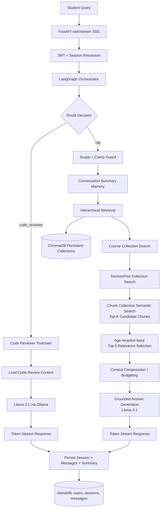

# AI LilMose3da
### Local Agentic RAG Tutor for Data Science: LangGraph-Orchestrated, Retrieval-First, and Fully On-Prem

## 1. Project Title & Catchy Subtitle

**AI LilMose3da** is a local-first AI learning assistant engineered for Data Science education.
It combines a retrieval-augmented generation (RAG) pipeline with tool-based orchestration to route user intent between:

- High-precision course question answering
- Code explanation and debugging support

All core models run locally through Ollama to reduce dependency on external APIs and improve privacy for classroom usage.

## 2. Overview & Impact

AI LilMose3da was built as a production-style academic assistant that can handle both conceptual learning and practical coding support in a single conversational system. The backend uses FastAPI for streaming inference, LangGraph for deterministic tool routing, ChromaDB for semantic retrieval, and a MariaDB-backed session layer for persistent conversational state.

The retrieval subsystem is intentionally multi-stage and hierarchical:

- Coarse course-level narrowing
- Section-level narrowing
- Dense chunk-level semantic retrieval
- Cross-encoder reranking with bge-reranker-base
- Context compression before final generation

This architecture improved student checkpoint outcomes from a baseline around **60%** to a consistent **87-92%** after deployment in local learning workflows.

> **Measured Outcome:** Structured AI-assisted study sessions powered by grounded retrieval increased checkpoint performance from **60%** to **87-92%**.

## 3. Architecture

### System Flow

The platform is built around a LangGraph router node that dispatches each query to a specialized execution path:

- **RAG path** for grounded course-content QA
- **Code reviewer path** for code explanation, debugging, and follow-up code edits

For RAG, the system performs hierarchical retrieval over three Chroma collections (`course`, `part`, `chunk`), gathers top semantic candidates (top-25 design target), reranks to top-5 with `bge-reranker-base`, compresses context when needed, and then prompts `llama3.1` for final grounded response generation.

FastAPI streams token outputs over SSE, while user accounts, sessions, titles, message history, and memory summaries are persisted through the backend session management layer backed by MariaDB.



### Data and Control Planes

- **Control plane:** LangGraph state machine handles deterministic routing and node transitions.
- **Retrieval plane:** ChromaDB semantic search + cross-encoder reranking.
- **Generation plane:** Llama 3.1 (Ollama) constrained by retrieved context and guardrails.
- **Persistence plane:** MariaDB stores user/session/message continuity and session-level memory summaries.

## 4. Key Features

- **Agentic Orchestration with LangGraph:** Query-level dynamic routing between RAG and code-review execution paths.
- **Hierarchical Semantic Retrieval:** Course -> section -> chunk narrowing to reduce retrieval noise and improve grounding quality.
- **Multi-Stage RAG Pipeline:** Candidate retrieval + cross-encoder reranking + context compression before generation.
- **Grounded Response Policy:** Generation is explicitly constrained to retrieved context with out-of-scope and ambiguity safeguards.
- **Persistent Conversational Memory:** Summary-based memory supports follow-up continuity across sessions.
- **Structured Session Infrastructure:** User auth, session lifecycle, title management, and message history persisted in backend storage.
- **Real-Time Streaming UX:** SSE token streaming from FastAPI for responsive chat interactions.
- **Local-First Deployment:** Ollama-hosted models and local vector DB for low-latency, privacy-aware educational use.
- **Code Assistance Path:** Dedicated tooling for explaining, debugging, and iterating over code-centric student prompts.

## 5. Tech Stack

| Category | Technologies |
|---|---|
| **LLMs** | `llama3.1` via Ollama |
| **Embedding Models** | `nomic-embed-text` via Ollama Embeddings API |
| **Reranking** | `BAAI/bge-reranker-base` (Sentence Transformers CrossEncoder) |
| **Orchestration** | LangGraph, LangChain Core |
| **RAG Retrieval** | ChromaDB (`PersistentClient`) with hierarchical collections (`courses`, `parts`, `chunks`) |
| **Backend API** | FastAPI, Pydantic, SSE streaming (`StreamingResponse`) |
| **Session/Data Persistence** | MariaDB-compatible relational schema accessed with PyMySQL |
| **Authentication** | JWT (`python-jose`), secure HTTP-only cookies |
| **Frontend** | React + Vite, Axios, Markdown/KaTeX rendering |
| **Infrastructure** | Dockerized local deployment, local model serving with Ollama |

---

This project is designed to showcase production-minded AI engineering: retrieval-grounded generation, explicit orchestration, memory-aware dialogue, and end-to-end persistence under a local-first deployment model.

## 6. Docker Deployment

You can run the full stack (frontend + backend + MariaDB + Ollama) with Docker Compose.

### Configure secrets

Create a local env file from the template and set your real values:

```bash
cp .env.example .env
```

The `.env` file is ignored by git, so secrets stay out of source control.

### Start services

```bash
docker compose up --build -d
```

### Pull required Ollama models (first run only)

```bash
docker compose exec ollama ollama pull llama3.1
docker compose exec ollama ollama pull nomic-embed-text
```

### Access apps

- Frontend: http://localhost:5173
- Backend API health: http://localhost:8000/health
- Ollama API: http://localhost:11434

### Stop services

```bash
docker compose down
```